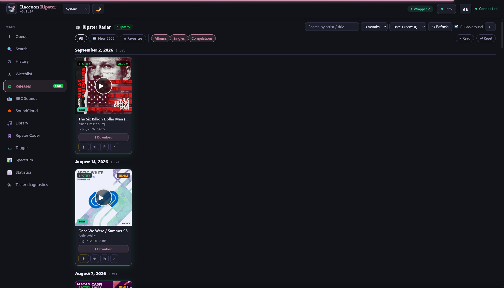
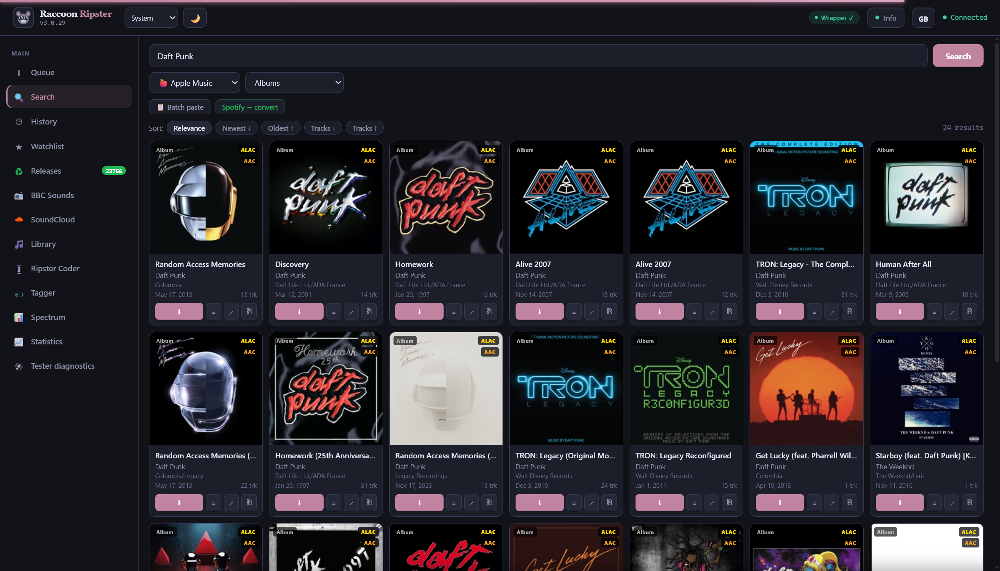
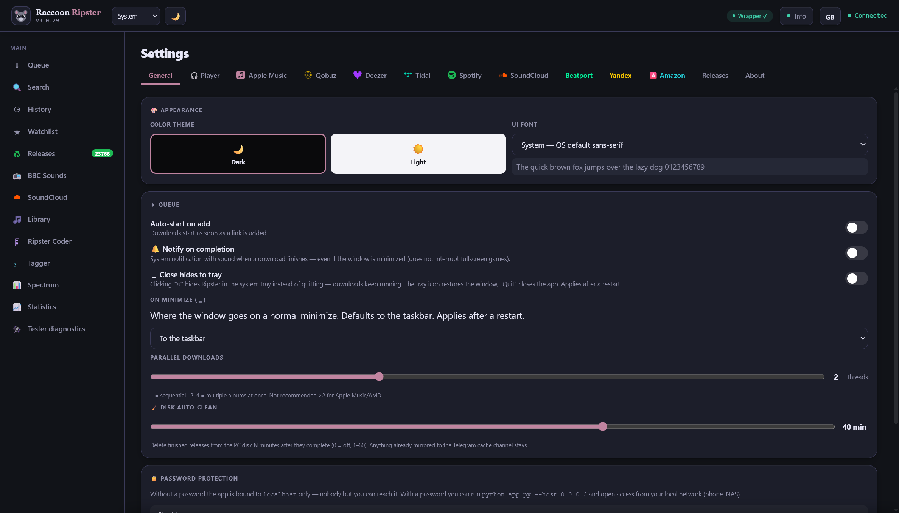
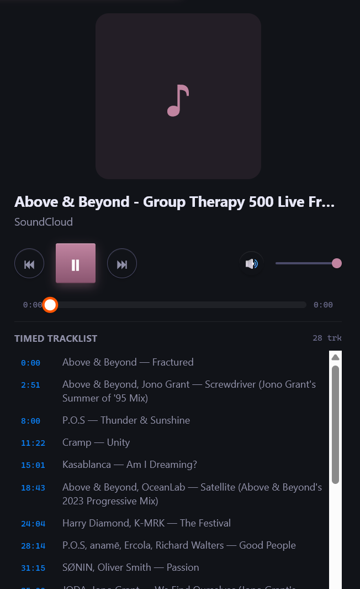

# Ripster

A self-hosted desktop app for downloading music from **Apple Music, Qobuz,
Deezer, Tidal, Beatport, SoundCloud and Yandex Music**, plus **Spotify** link
conversion (it finds the same release on a service you have access to and grabs
that). It runs entirely on your own machine and opens in its own window — there
is no account with *us*, no cloud, and your files never leave your computer.

> You need your own valid subscriptions / credentials for each service you use.
> Ripster automates downloading from services **you already pay for** — it does
> not provide accounts and does not bypass paid tiers.

---

## Contents

- [What you get](#what-you-get)
- [Install on Windows (the easy way)](#install-on-windows-the-easy-way)
- [First launch](#first-launch)
- [Downloading your first track](#downloading-your-first-track)
- [Where your music is saved](#where-your-music-is-saved)
- [Connecting each service](#connecting-each-service)
- [Choosing quality](#choosing-quality)
- [Optional components (Setup tab)](#optional-components-setup-tab)
- [Updating Ripster](#updating-ripster)
- [Troubleshooting](#troubleshooting)
- [Running from source (advanced)](#running-from-source-advanced)
- [Credits](#credits)
- [Disclaimer & License](#disclaimer--license)

---

## What you get

- 🎚 **Many services & qualities** — ALAC / AAC / Dolby Atmos for Apple Music,
  FLAC up to 24-bit/192 kHz for Qobuz / Deezer / Tidal, lossless SoundCloud,
  Beatport, Yandex Music, and Spotify link conversion.
- 🔁 **Download queue** with parallel downloads, automatic retry, and recovery of
  partially-finished albums.
- 🔍 **Search** across services, plus a **watchlist** and a full **download
  history**.
- 🦝 **Ripster Radar** — a release-tracking feed for the artists you follow on
  Spotify. It's not just a periodic re-scan: it also hooks the same
  personalized "new for you" signal Spotify's own app uses, so a fresh drop
  can show up within minutes instead of the next scheduled pass — flagged
  with its own **⚡ Live** badge on the card.
- 🎛 **DJ Coder** — stitch a multi-track release into one gapless mix with a CUE
  sheet.
- 📊 **Spectrogram** view to confirm a file is really lossless (and not an
  upscaled fake).
- 🎧 Built-in **gapless player** with a visualizer, and a **timed tracklist**
  for DJ mixes / radio shows (SoundCloud) — click through to any track inside
  a 2-hour set instead of scrubbing blind.
- 🌍 **5-language interface** — English, Russian, Hindi, Japanese, Chinese.
- 🖥 Opens in a **real desktop window** (no browser tab needed).

---

## Screenshots

| Ripster Radar | Search | Settings |
|---|---|---|
| [](screenshots/01_release_radar.png) | [](screenshots/02_search.png) | [](screenshots/03_settings.png) |

| Timed tracklist (SoundCloud mixes) |
|---|
| [](screenshots/04_sc_tracklist.png) |

---

## Install on Windows (the easy way)

1. Go to the **[Releases](https://github.com/Raccoon-Trashpanda/Raccoon-Ripster/releases)**
   page and download the latest **`RipsterSetup-<version>.exe`**.
2. Run it. Windows SmartScreen may warn "unknown publisher" — that is expected
   for a small unsigned app. Click **More info → Run anyway**.
3. Pick an install folder (the default is fine) and click **Install**. The
   installer copies a self-contained Python and all dependencies — **no separate
   Python install, no admin rights, no internet downloads during setup.**
4. When it finishes you get a **Ripster** shortcut on the Desktop and Start menu.

> **Installing over an older version?** Just run the new installer into the
> **same folder** — it upgrades in place. Your settings, logins, and downloaded
> music are kept. You do **not** need to uninstall the old version first.

---

## First launch

Double-click the **Ripster** shortcut. The app opens in its own desktop window
(it uses the built-in Edge WebView; if that is missing it falls back to your
default browser at **http://127.0.0.1:7799**).

The first time, it creates a `config.yaml` from the bundled example with sensible
defaults — Apple Music in ALAC via a free public decryption service, queue
auto-start on, two parallel downloads. You can change everything later in the
**Settings** tab.

> If you ever open it in a browser, always use **`http://127.0.0.1:7799`** and
> **not** `http://localhost:7799` — Spotify's login rejects `localhost`.

---

## Downloading your first track

1. Copy a link from any supported service (e.g. an Apple Music album page, a
   Qobuz album, a Tidal track, a Spotify playlist…), **or** use the **Search**
   tab to find a release.
2. Paste the link into the box at the top and press **Download** (or just hit
   Enter).
3. The release appears in the **Queue** and starts downloading. Albums and
   playlists are automatically expanded into one entry per track, with a live
   progress bar.
4. When it is done it shows up in **History**, and the files are on your disk.

That's it — no token needed for Apple Music ALAC (it uses a free public
decryption service out of the box).

---

## Where your music is saved

By default everything lands in a **`downloads`** folder inside your Ripster
install folder, organized by quality / service / artist / album. For example,
an Apple Music lossless album ends up at:

```
<your Ripster folder>\downloads\ALAC (Lossless)\<Artist>\<Album>\01 - Track.m4a
```

You can change the destination any time in **Settings → Save path** (set it to,
say, `D:\Music` or your existing library folder). Each service also has its own
path override in Settings if you want them separated.

---

## Connecting each service

Most services need *your* credentials. You enter them once in **Settings**; they
are stored locally in `config.yaml` and never sent anywhere except to that
service. Leave a service blank to skip it.

| Service | What you need | Where to get it |
|---------|---------------|-----------------|
| **Apple Music** | Nothing for standard ALAC/Atmos (a free public decryption service is used). For account-specific features: `media-user-token` + `authorization-token`. | The **"Login via Apple"** button in Settings, or your browser DevTools on music.apple.com. |
| **Qobuz** | Auth token, or email + password. | Your Qobuz account. |
| **Deezer** | The `arl` cookie. | deezer.com → browser DevTools → Application → Cookies → `arl`. |
| **Tidal** | One-time device login. | The **device-login button** in Settings (it stays logged in and refreshes itself). |
| **Spotify** | Client ID + Client Secret (used to read metadata and convert links — the audio comes from another service you have). | developer.spotify.com → create an app → set redirect URI to `http://127.0.0.1:7799/spotify/callback`. |
| **SoundCloud** | OAuth token. | From your logged-in browser session. |
| **Beatport / Yandex** | Account login / OAuth token. | Entered in Settings; see the in-app hints. |

> **Apple Music tip:** for plain lossless (ALAC) you do **not** need any token or
> VPN. The public service carries its own access. A token is only needed for
> account-tied extras.

---

## Choosing quality

Open **Settings → Quality** (or pick a quality on each download). Typical picks:

- **Apple Music:** `ALAC` (lossless, up to 24-bit) · `AAC` (256 kbps) ·
  `Dolby Atmos`.
- **Qobuz / Tidal / Deezer:** `FLAC` up to 24-bit/192 kHz (subject to what the
  release and your subscription allow).
- **SoundCloud:** lossless where available, otherwise the highest AAC.

You can also set a global **output format** (e.g. always transcode to MP3 or
FLAC) under Settings — leave it as *native* to keep the original.

---

## Optional components (Setup tab)

Some heavyweight tools are **not** bundled (to keep the installer small) and are
fetched on demand from the **Setup** tab — each as its own row with its own
button and status:

- **Apple Go downloader**, **ffmpeg**, **Bento4** (for Apple lossless decrypt)
- **Node.js + SoundCloud (Lucida)** components
- **OrpheusDL** (Beatport / Spotify metadata engine)
- Your own **Widevine device** for protected streams

In most cases you don't have to touch this — Ripster installs what a download
needs automatically the first time it needs it (for example, the Apple lossless
tools are pulled in on your first ALAC download).

---

## Updating Ripster

There are two ways to update:

1. **In-app (recommended):** open the **Setup** tab and use **Check for updates →
   Update now**. Ripster downloads the newest release and applies it in place,
   keeping your settings, logins, and music, then restarts. A small badge on the
   Setup tab tells you when a new version is available.
2. **Reinstall:** download the newest `RipsterSetup-<version>.exe` from
   [Releases](https://github.com/Raccoon-Trashpanda/Raccoon-Ripster/releases) and
   run it into the same folder (upgrade in place — nothing is lost).

---

## Troubleshooting

**The window won't open / nothing happens.**
Make sure no other copy is already running (look for a Ripster icon in the tray /
task manager). If a browser opens instead of a window, your system is missing the
Edge WebView2 runtime — install it from Microsoft, or just use the browser at
`http://127.0.0.1:7799`.

**Apple lossless (ALAC) fails at "Decrypting song…".**
The lossless decrypt tools (Bento4) are installed automatically on the first
ALAC download. If it still fails, open **Setup → Bento4** and install it
manually, and check your internet/firewall isn't blocking the download. This is
**not** a token or VPN problem — standard ALAC needs neither.

**A download stops partway / "partial".**
Ripster retries automatically. A persistent partial usually means the release is
region-locked, or a free public service was momentarily overloaded — try again,
or pick standard quality instead of Hi-Res for very large files on a slow
connection. Use the **↺ retry** button on the queue entry.

**Spotify says 403 / login rejected.**
Spotify needs a Premium account on the app owner's side and the exact redirect
URI `http://127.0.0.1:7799/spotify/callback` in your developer dashboard. Always
use `127.0.0.1`, never `localhost`.

**Where did my files go?**
See [Where your music is saved](#where-your-music-is-saved) — by default the
`downloads` folder inside your install folder. The exact path of any finished
download is also recorded in **History**.

**Still stuck?**
The **Console** tab has a live log with **Copy** and **Download log** buttons —
grab that when reporting an issue.

---

## Running from source (advanced)

**Windows only** — the packaged installer and the tooling Ripster automates
(the Apple decrypt wrapper, WebView2, etc.) are Windows-specific. There is no
macOS or Linux build.

You need **Python 3.12** (3.11+ should work) and **ffmpeg** on your `PATH`.

```bat
git clone https://github.com/Raccoon-Trashpanda/Raccoon-Ripster.git
cd Raccoon-Ripster
run.bat
```
`run.bat` creates a virtual environment, installs dependencies, copies
`config.example.yaml` → `config.yaml` on first run, and launches the app.

**Pinned dependencies (don't loosen):** `streamrip==2.0.5` (2.1.x has Tidal/login
regressions) and `protobuf==6.33.4` (required by the Apple wrapper and the
OrpheusDL / Widevine gencode). See `requirements.txt`.

---

## Credits

Ripster is a user-interface and orchestration layer — the heavy lifting is done
by the excellent open-source projects below. **Huge thanks to every author and
contributor.** If your project is used here and you'd like the credit adjusted or
removed, please open an issue.

### Download engines
- [zhaarey / apple-music-downloader](https://github.com/zhaarey/apple-music-downloader) — Apple Music in ALAC & Dolby Atmos via a local wrapper *(this project builds on it)*
- [glomatico / gamdl](https://github.com/glomatico/gamdl) — Apple Music via account cookies — AAC & music videos
- [WorldObservationLog / AppleMusicDecrypt](https://github.com/WorldObservationLog/AppleMusicDecrypt) — Apple Music ALAC/Atmos via public wrapper — no Apple ID
- [nathom / streamrip](https://github.com/nathom/streamrip) — Qobuz, Tidal, Deezer, SoundCloud — FLAC up to Hi-Res
- [lucida](https://codeberg.org/lucida/lucida) — SoundCloud streaming & downloads
- [llistochek / yandex-music-downloader](https://github.com/llistochek/yandex-music-downloader) — Yandex Music FLAC (with Plus)
- [OrpheusDL](https://github.com/OrfiTeam/OrpheusDL) + [Dniel97 / orpheusdl-beatport](https://github.com/Dniel97/orpheusdl-beatport) — Beatport & modular Spotify/metadata engine
- [zotify-dev / zotify](https://github.com/zotify-dev/zotify) — Spotify downloads via account streaming
- [librespot-org / librespot](https://github.com/librespot-org/librespot) & [kokarare1212 / librespot-python](https://github.com/kokarare1212/librespot-python) — open Spotify Connect client
- [Nizarberyan / SpotiFLAC](https://github.com/Nizarberyan/SpotiFLAC) — Spotify → lossless source matching
- [deemix](https://pypi.org/project/deemix/) *(RemixDev)* — Deezer download library

### Decryption & wrappers
- [itouakirai / wrapper](https://github.com/itouakirai/wrapper) — Apple Music (ALAC) decryption in a Docker container
- [WorldObservationLog / wrapper-manager](https://github.com/WorldObservationLog/wrapper-manager) — public wrapper-instance pool
- [WorldObservationLog / pywidevine](https://github.com/WorldObservationLog/pywidevine) — Widevine CDM for protected streams
- [hyugogirubato / KeyDive](https://github.com/hyugogirubato/KeyDive) & [wvdumper / dumper](https://github.com/wvdumper/dumper) — Widevine L3 device (.wvd) extraction

### Media processing
- [FFmpeg](https://ffmpeg.org) — transcoding & muxing of audio/video
- [GPAC / MP4Box](https://gpac.io) — MP4 packaging incl. Dolby Atmos
- [axiomatic-systems / Bento4](https://github.com/axiomatic-systems/Bento4) — `mp4decrypt` / `mp4extract`, DRM removal
- [nilaoda / N_m3u8DL-RE](https://github.com/nilaoda/N_m3u8DL-RE) — HLS segment downloading

### Metadata & search APIs
- [iTunes Search API](https://performance-partners.apple.com/search-api) — Apple Music catalog
- [Deezer API](https://developers.deezer.com/api) · [Qobuz API](https://www.qobuz.com/api.json/0.2) · [Tidal API](https://developer.tidal.com/documentation)
- [MarshalX / yandex-music-api](https://github.com/MarshalX/yandex-music-api) — Yandex Music search, metadata & token

### Built with
[FastAPI](https://github.com/tiangolo/fastapi) ·
[Uvicorn](https://github.com/encode/uvicorn) ·
[websockets](https://github.com/python-websockets/websockets) ·
[HTTPX](https://github.com/encode/httpx) ·
[Mutagen](https://github.com/quodlibet/mutagen) ·
[PyYAML](https://github.com/yaml/pyyaml) ·
[protobuf](https://github.com/protocolbuffers/protobuf) ·
[gRPC](https://github.com/grpc/grpc) ·
[pywebview](https://github.com/r0x0r/pywebview)

---

## Disclaimer & License

Ripster is **not affiliated with** Apple, Spotify, Qobuz, Tidal, Deezer,
SoundCloud, Beatport, or Yandex. All trademarks belong to their respective
owners.

**For personal use.** Respect the terms of service of each music provider and
only download content you are entitled to.
